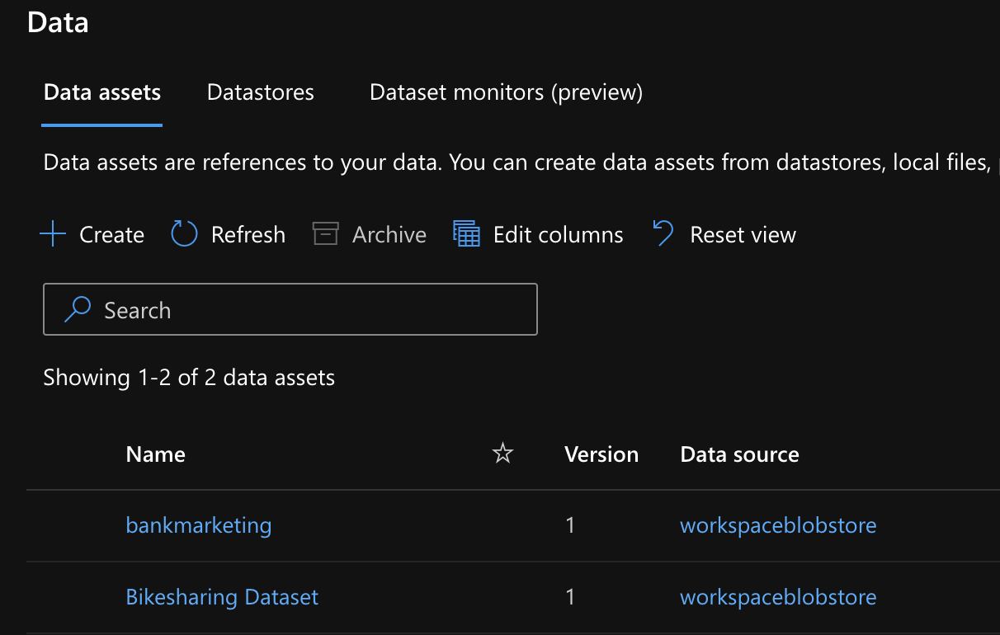
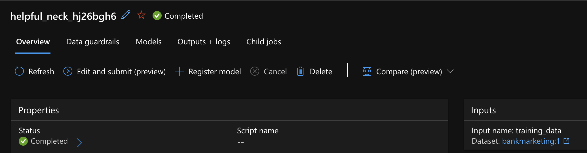
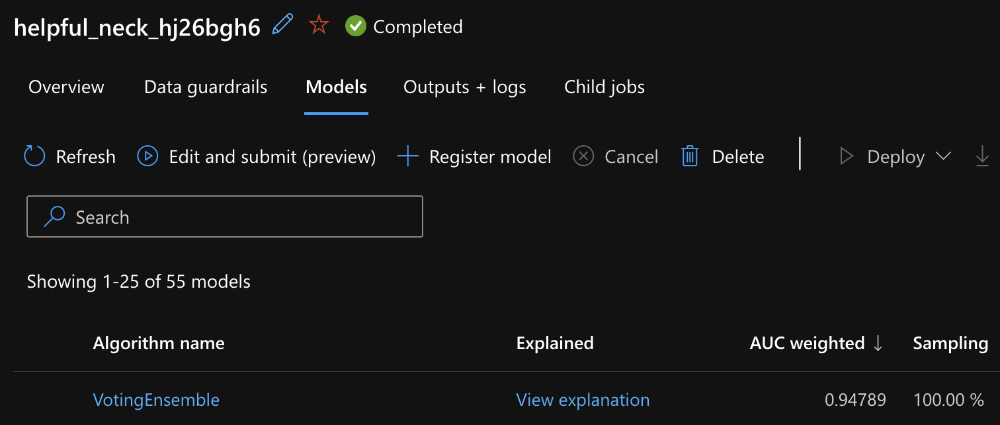
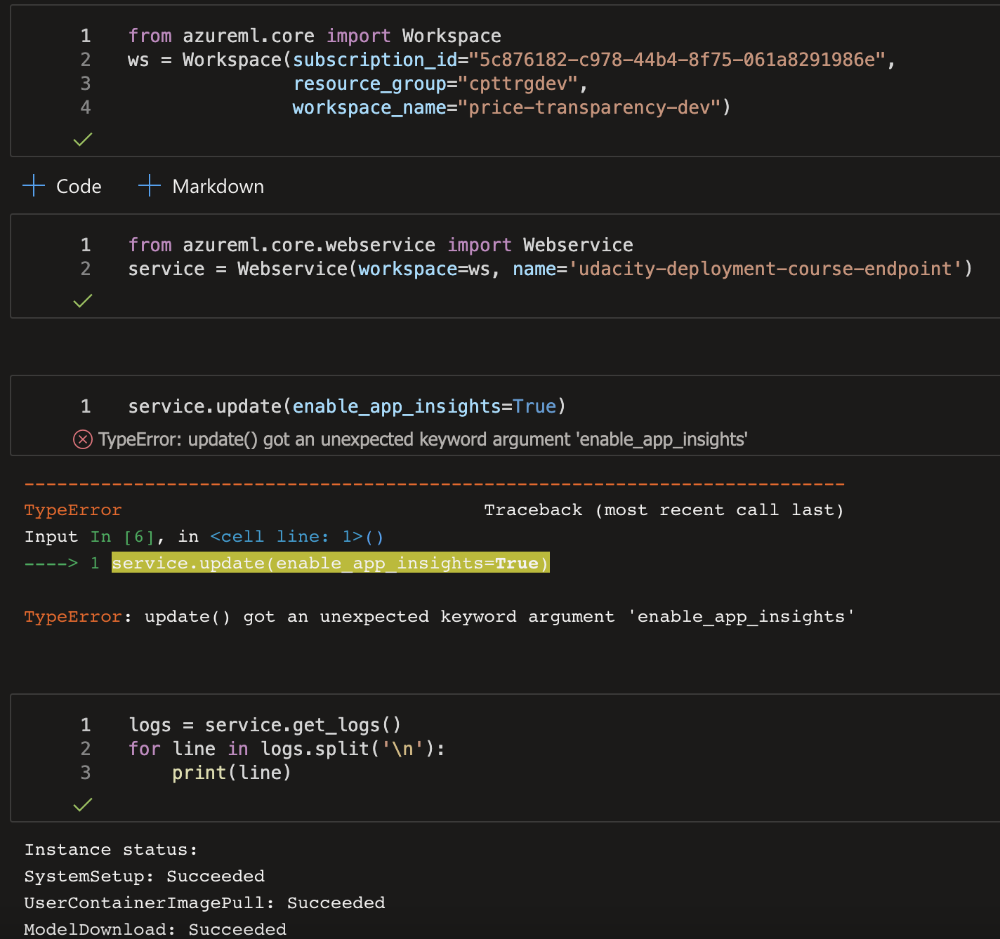
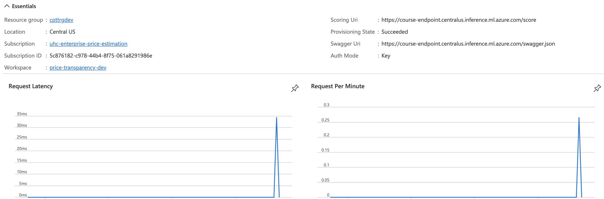
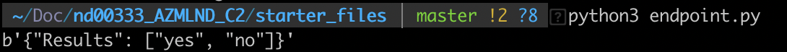
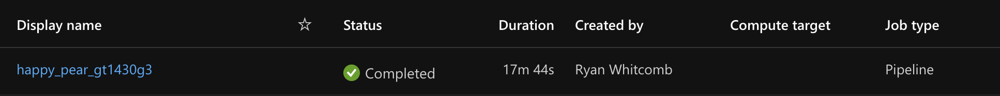
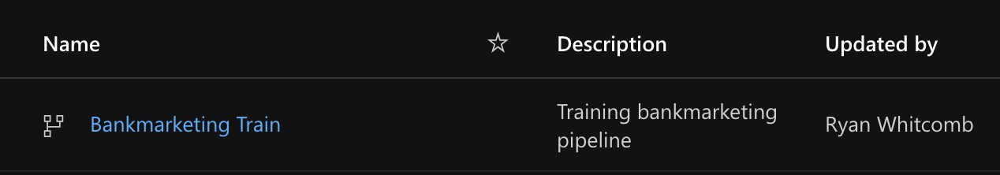
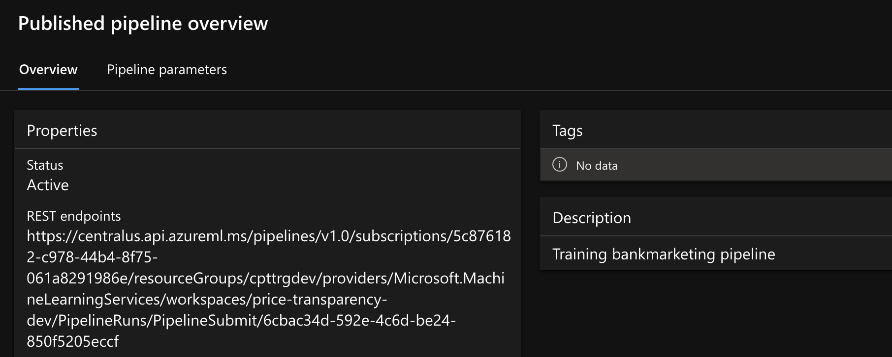
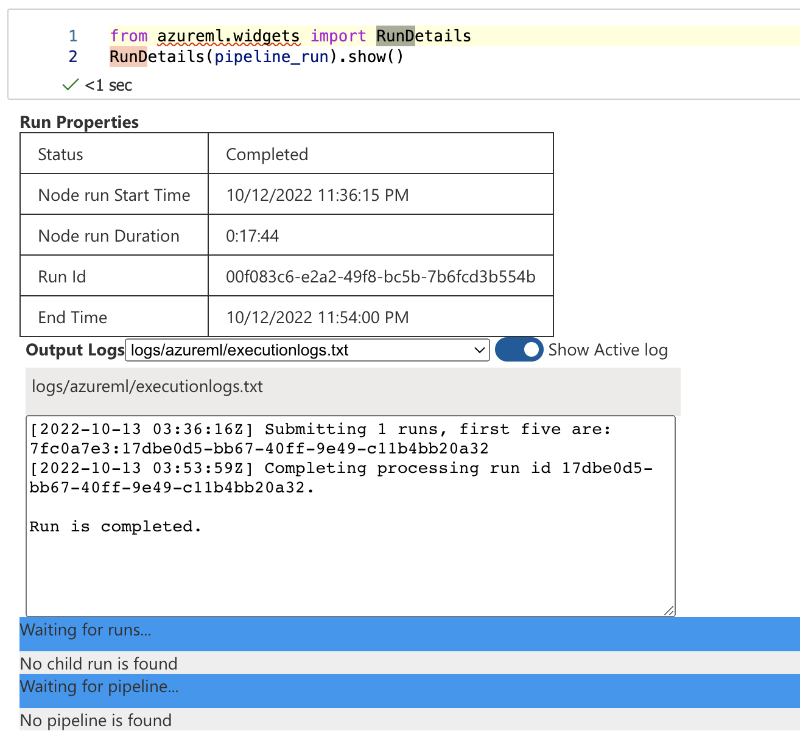

# Project: Operationalizing Machine Learning
This experiment contained information about a marketing campaign from a banking network. Information included age, marital status, default, loan information, and education. The bank is looking to predict the probability of a successful engagement with a client.

Using this data, an automated ML model was created and deployed using Azure Machine learning.  With this deployment a consumable endpoint was created that has monitoring and documentation capabilities.  Lastly, a pipeline was created to invoke the entire process with reusable and scalable code via the Azure SDK.

## Architectural Diagram

This diagram, provided via the Udacity course, gives an overview of the flow of activity taken. It highlights the dependencies that authentication has on the entire process.  Then AutoML was invoked to register the bank marketing data and find the  best classification model on the data.  Once the model is selected an endpoint is created to enable consumption as well as logging capabilities. In order to replicate these steps, a pipeline can be created to create a reusable code base.

## Key Steps
1. Authentication - User roles were established and verified for using Azure ML
2. Auto ML Model - Registered the bank marketing data and trained a classification model on it
First the data was uploaded as a dataset for easy consumption within AutoML.

Then it was able to run a classification approach on the registered data.

3. Deploy Best Model - Auto ML selected the best model, which was then deployed in Azure ML
Once the automl was run, you can extract the best model run.

Then the model was deployed for consumption by other applications.  However, application insights is being depreciated, and the ability to turn that on in V2 Azure is not possible anymore.  As a workaround, the Azure portal provides many direct ways to monitor the model performance and traffic over time.  Additionally, the logs can be retrieved as well.

4. Enable Logging - Funcationality was enabled to check the model status and performance
Jabber funcationality was not working in the V2 workspace.  The Azure portal allows other alternatives to going outside of the Azure ecosystem for monitoring and documentation.

5. Consome Model End Points - Data was fed to the model to check functionality
The model endpoints were tested for proper funcionality.  This can also be done manually through the UI.

6. Create and Publish a Pipeline - A reusable code-driven approach to establishing an endpoint
A pipeline can repeat all the above steps using repeatable and savable code.

The pipeline can register data.

The pipeline can create endpoints for models.

Lastly, there is meta information about the pipeline performance itself, which is useful in a production setting.

## Screen Recording
Screen Recording Demonstration is located at: https://vimeo.com/759769414
