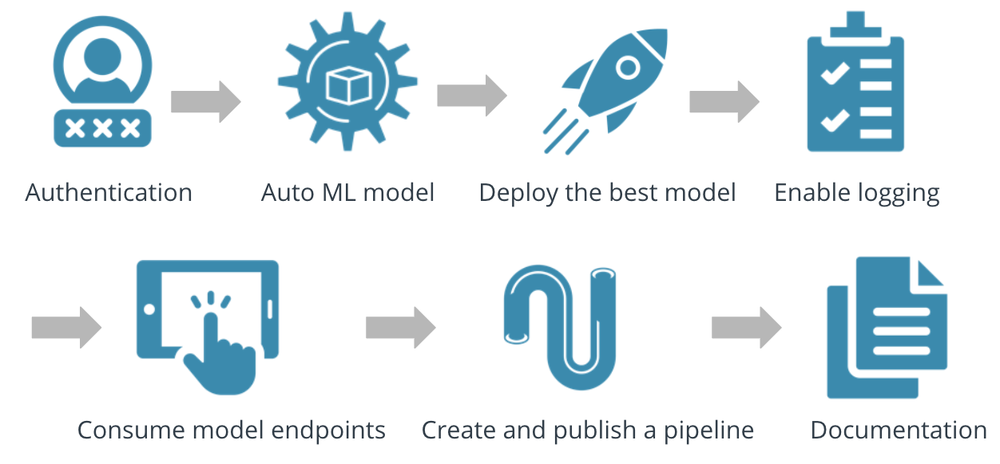

# Project: Operationalizing Machine Learning
This experiment contained information about a marketing campaign from a banking network. Information included age, marital status, default, loan information, and education. The bank is looking to predict the probability of a successful engagement with a client.

Using this data, an automated ML model was created and deployed using Azure Machine learning.  With this deployment a consumable endpoint was created that has monitoring and documentation capabilities.  Lastly, a pipeline was created to invoke the entire process with reusable and scalable code via the Azure SDK.

## Architectural Diagram

This diagram, provided via the Udacity course, gives an overview of the flow of activity taken. It highlights the dependencies that authentication has on the entire process.  Then AutoML was invoked to register the bank marketing data and find the  best classification model on the data.  Once the model is selected an endpoint is created to enable consumption as well as logging capabilities. In order to replicate these steps, a pipeline can be created to create a reusable code base.

## Key Steps
1. Authentication - User roles were established and verified for using Azure ML
2. Auto ML Model - Registered the bank marketing data and trained a classification model on it

3. Deploy Best Model - Auto ML selected the best model, which was then deployed in Azure ML

4. Enable Logging - Funcationality was enabled to check the model status and performance

5. Consome Model End Points - Data was fed to the model to check functionality

6. Create and Publish a Pipeline - A reusable code-driven approach to establishing an endpoint

## Screen Recording
Screen Recording Demonstration is located at:

